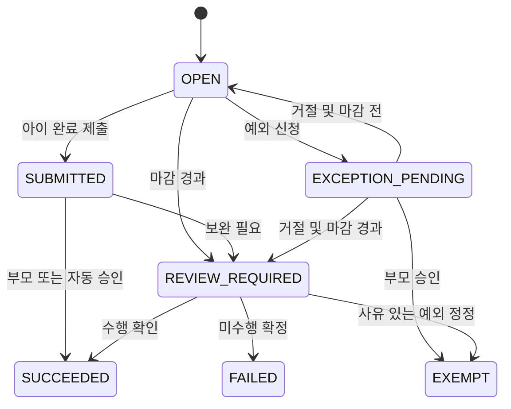
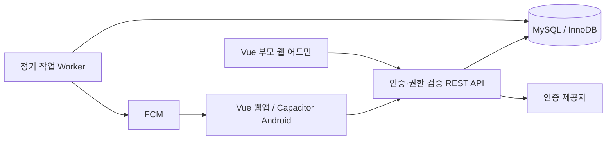

# 우리 가족 앱 기획 및 기본 설계

- 문서 버전: 0.4
- 수정일: 2026-09-14
- 작성일: 2026-09-12
- 상태: 개발 참조용 초안. 현재 운영 규칙과 제안 설계를 구분함.
- 대상: 부모 2명, 2012년생 아들, 2014년생 딸. 가족 모두 개인 안드로이드폰 사용.
- 범위: 안드로이드 앱, 부모용 웹 어드민, 공통 서버, 데이터베이스, 정기 작업, 알림.
- 구현 상태: Vue 웹·API 1차 구현. 실제 완료 범위와 남은 작업은 [개발 안내](DEVELOPMENT.md)를 기준으로 확인한다. 기획 전체가 구현된 것은 아니다.

## 1. 문서 사용 원칙

개발 시 이 문서를 기능과 정책의 기준으로 참조한다. `확정`은 사용자 설명 또는 노션 운영 규칙에서 확인한 사항이고, `제안`은 구현을 위한 초안이다. 제안은 사용자 합의 전 운영 정책으로 확정하지 않는다. 화면과 기반 구조는 먼저 개발할 수 있지만 포인트에 영향을 주는 미결정 정책은 실제 가족 데이터에 적용하기 전에 확정한다.

정책 변경은 이 문서와 변경 이력에 함께 기록한다. 기존 미션 및 포인트 이력을 새 규칙으로 덮어쓰지 않는다. 개발에 필요한 비밀번호, 인증 키, 실제 계좌번호는 이 문서나 저장소에 넣지 않는다.

### 1.1 근거와 우선순위

1. 사용자가 이후 명시한 변경 사항
2. [현재 미션 포인트 제도](https://app.notion.com/p/okojj/32c1b57c3df9805bbb0ccf0a7136d181)
3. 본 문서의 확정 사항
4. 본 문서의 제안 및 기본 설계

노션 본문에서 확인한 최근 편집일은 2026-07-07이다. 연결된 일별 기록·지급내역 데이터베이스의 실제 행은 확인하지 않았다. 과거 잔액이나 지급 현황은 추정하지 않는다. 초기 대화에 나온 `1P=10원`, `미수행 시 차감 없음`, `정기 용돈 유지`는 예시였으며 현재 기준이 아니다.

## 2. 제품 목표와 성공 기준

아이들이 오늘의 미션을 스스로 확인하고, 수행 결과와 보상을 이해하며, 가족이 일정을 공유하는 앱을 만든다. 부모는 반복 등록과 수기 계산을 줄이고 일요일 가족회의에서 지급 내역을 정리한다.

### 핵심 경험

- 아이: 오늘 미션 확인 → 완료 제출 → 결과와 포인트 확인 → 인출 신청.
- 부모: 승인·예외 확인 → 주간 현황 확인 → 실제 송금 → 지급 완료 기록.
- 가족: 일정·준비물·기념일 확인 → 필요한 사람에게 알림.

### 2주 시험 운영의 평가 기준 — 제안

- 아이가 도움 없이 미션 확인과 완료 제출을 할 수 있다.
- 완료 제출은 미션 목록에서 두 번 이내의 조작으로 끝난다.
- 부모가 미결 항목과 지급 대상액을 한 화면에서 확인한다.
- 중복 적립·중복 지급·설명되지 않는 잔액 차이가 없다.
- 알림을 꺼도 앱 안에서 할 일과 처리 결과를 확인할 수 있다.
- 주간 가족회의에서 승인 부담과 보상 관련 갈등을 확인해 규칙을 조정한다.

## 3. 현재 미션 정책 — 확정

정기 지급형 용돈을 폐지하고 미션으로 적립한 포인트를 개인별 계좌로 지급한다.

| 미션 | 반복 | 수행 기준 | 성공 | 미수행 |
|---|---|---|---:|---:|
| 기상 시간 지키기 | 평일 | 07:30에 스스로 일어나기 | +5P | -5P |
| 등교 시간 지키기 | 평일 | 08:30까지 집에서 나가기 | +5P | -5P |
| 취침 시간 지키기 | 매일 | 22:50까지 잘 준비하고 눕기 | +5P | -5P |
| 일별 할 일 완수 | 매일 | 학교·학원 숙제 완료, 숙제는 하루 전날까지 | +10P | -10P |

| 추가 미션 | 기준 | 보상 |
|---|---|---:|
| 고양이 화장실 청소 | 화장실 4곳 치우기 | +5P |
| 고양이 화장실 물청소 | 화장실 비우고 물청소하기 | +5P |
| 재활용 쓰레기 버리기 | 주 1회 | +5P |

- 기본 미션을 모두 완료한 날이 주 5일 이상이면 추가 10P.
- 사전 승인 시 미션 예외 인정.
- 환전율: 1P = 100원.
- 정산 및 보상 정산: 매주 일요일 저녁 가족회의.
- 지급 수단: 개인별 계좌. 앱 내 자동 송금 요구는 없음.
- 모든 기본 미션 성공 시 평일 125P + 주말 30P + 주간 보너스 10P = 주 165P, 16,500원/아이. 추가 미션은 별도.

## 4. 미결정 정책과 개발 기본안

다음은 확정된 가족 규칙이 아니다. 관리자가 첫 운영 설정에서 선택하고 확인하도록 한다.

| ID | 결정할 항목 | 제안 기본안 | 영향 |
|---|---|---|---|
| D01 | 주간 범위 | 월요일 00:00~일요일 24:00, Asia/Seoul | 보너스·주 1회 제한 |
| D02 | 일요일 저녁 이후 미션 | 주간 보너스는 월요일 00:10 이후 산정. 일요일에는 확정 잔액만 지급 | 당일 취침 전 보너스 선지급 방지 |
| D03 | 예외와 전체 완료일 | 예외 항목 제외 후 남은 기본 미션 모두 성공이면 인정. 모두 예외인 날은 미인정 | 보너스 계산 |
| D04 | 마이너스 잔액 | 음수 기록 허용, 인출 가능액은 0 이상 | 미수행 차감을 정확히 기록 |
| D05 | 승인 방식 | 초기에는 부모 확인 후 적립. 미션별 자동 승인 선택 가능 | 확인 부담·신뢰 |
| D06 | 미체크 처리 | 마감 후 확인 필요로 표시, 부모가 미수행 확정 후 차감 | 단순 입력 누락과 실패 구분 |
| D07 | 추가 미션 횟수 | 청소 종류별 가족 전체 하루 1회, 재활용 가족 전체 주 1회 | 중복 보상 방지 |
| D08 | 공동 수행 | 첫 버전은 한 명 담당. 공동 수행은 부모가 사유를 남겨 별도 조정 | 자동 중복 지급 방지 |
| D09 | 제출 시간 | 수행 시각과 제출 시각 분리, 늦은 제출은 부모 확인 | 취침 뒤 휴대폰 사용·입력 누락 처리 |
| D10 | 최소 인출 | 1P 단위, 최소 1P, 주 1회 지급 | 기존 문서에 최소액 없음 |
| D11 | 공휴일·방학 | 평일은 우선 월~금. 휴일·방학은 부모가 기간 예외 등록 | 달력 API 없이 운영 |
| D12 | 추가 미션 차감 | 선택 미션은 미수행 차감 없음 | 선택 활동의 성격 유지 |
| D13 | 음력 기념일 | 첫 버전 양력 지원. 음력 사용 시 변환·윤달 규칙 추가 후 지원 | 조용한 날짜 오류 방지 |
| D14 | 부모의 승인·지급 권한 | 엄마·아빠 모두 승인 및 지급 기록 가능 | 중복 처리 방지는 서버 담당 |

주간 종료 시 확인 대기가 있으면 해당 주를 `잠정`으로 표시하고 보너스 적립을 보류한다. 부모가 미결 항목을 처리하면 다시 계산한다. 이미 지급한 주의 결과 정정은 원장을 수정하지 않고 역분개·추가 조정으로 반영한다.

## 5. 출시 범위

### P0: 첫 가족 시험 버전

- 가족 생성·초대·로그인·역할 관리.
- 반복 미션 템플릿, 날짜별 미션 생성, 아이별 배정.
- 완료 제출, 부모 승인, 미수행 확정, 예외 승인, 정정 이력.
- 추가 미션 담당 선택 및 횟수 제한.
- 포인트 원장, 주간 보너스, 인출 신청·취소·지급 기록.
- 가족 일정: 일회성·매일·요일별·매년 반복, 참여자, 준비물, 픽업 담당.
- 양력 기념일: 매년 반복, 사전 알림.
- 앱 알림함·안드로이드 푸시·조용한 시간·개인별 설정.
- 부모용 웹 어드민 및 데이터 내보내기·백업.

### P1: 시험 운영 후

- 저축 목표, 아이의 미션 제안, 주간 돌아보기.
- 가족 공동 목표, 부모의 집안일 표시.
- 숙제 개별 목록과 제출일 기준 전날 마감 생성.
- 음력·윤달 기념일과 학사일정 전용 연동. Google Calendar 단방향 가져오기는 현재 구현 범위로 이동.
- 검증된 노션 과거 기록 일괄 가져오기.

### 첫 범위에서 제외

자동 계좌이체·금융 연결, 가족 외 공개 가입, 광고·결제, 형제자매 순위, 위치 추적, 가족 채팅, AI 판정, 사진 증빙 의무화, iOS 앱, 웹 푸시. 계좌번호는 첫 버전에 저장하지 않고 기존 송금 수단을 사용한다.

## 6. 역할과 권한

웹 어드민은 서비스 전체 운영자가 아닌 우리 가족 부모용 관리 화면이다. 앱의 부모 계정과 같은 계정·권한을 사용한다.

| 작업 | 아이 | 부모 |
|---|---|---|
| 오늘 미션 조회·완료 제출·예외 신청 | 본인 | 가족 전체 조회·처리 |
| 미션 정책·배정·보상 수정 | 불가 | 가능 |
| 승인·미수행·정정·포인트 수동 조정 | 불가 | 가능, 사유 기록 |
| 잔액·상세 원장 | 본인만 | 아이별 전체 |
| 인출 신청·대기 중 취소 | 본인 | 조회·승인·거절·지급 기록 |
| 가족 일정·기념일 조회 | 가능 | 가능 |
| 일정 생성·수정 | 본인 생성 일정, 참여자는 본인으로 제한 | 가족 전체 |
| 기념일·다른 사람 픽업 배정 | 불가 | 가능 |
| 알림 설정 | 본인 | 본인, 가족 기본값 설정 |
| 초대·역할·계정 비활성화·내보내기 | 불가 | 가능 |

서버가 매 요청의 가족 소속·역할·소유권을 검증한다. 화면에서 버튼을 숨기는 것으로 권한을 대체하지 않는다. 마지막 활성 부모는 탈퇴·강등할 수 없다. 아이 계정에 부모 역할을 직접 선택하는 가입 경로는 제공하지 않는다.

## 7. 안드로이드 앱 화면 설계

하단 탭: `오늘 / 달력 / 포인트 / 더보기`. 부모 로그인 시 오늘 화면에 관리 영역을 추가한다. 색상만으로 상태를 구분하지 않고 텍스트와 아이콘을 함께 표시한다. 유아용 장식이나 경쟁 순위보다 본인 진행 상황을 강조한다.

| ID / 경로 | 화면 | 주요 구성과 동작 |
|---|---|---|
| A01 /login | 시작·로그인 | 계정 로그인, 가족 초대 수락, 연결 실패 안내 |
| A02 /today | 아이 오늘 | 날짜, 기본 미션 카드, 추가 미션, 다음 일정, 주간 완료일 |
| A03 /missions/{id} | 미션 상세 | 기준·보상·기한, 완료 제출, 예외 신청, 처리 이력 |
| A04 /parent/today | 부모 오늘 | 아이별 현황, 완료·예외·미수행 확인 대기, 인출 요청 |
| A05 /calendar | 가족 달력 | 월·주·목록 보기, 가족별 필터, 일정·기념일 구분 |
| A06 /events/{id} | 일정 상세·편집 | 시간, 참여자, 장소, 준비물, 픽업 담당, 반복, 알림 |
| A07 /wallet | 포인트 지갑 | 총잔액, 인출 보류액, 인출 가능액, 원장, 인출 신청 |
| A08 /redemptions/{id} | 인출 상세 | 신청 P·원화, 상태, 취소, 부모 지급 기록 |
| A09 /weekly | 주간 현황 | 날짜별 성공·미수행·예외, 보너스 잠정/확정, 미결 항목 |
| A10 /notifications | 알림함 | 미션·일정·정산 결과, 읽음, 관련 화면으로 이동 |
| A11 /settings | 더보기 | 가족 구성원, 알림 설정, 로그인 기기, 로그아웃 |

### 오늘 화면 개념 배치

```text
오늘 9월 12일                     알림함
내 포인트 120P · 인출 가능 12,000원
이번 주 전체 완료 3일 / 5일

기본 미션
[확인 대기] 취침 시간 지키기       +5P / 미수행 -5P
[완료하기] 일별 할 일 완수         +10P / 미수행 -10P

추가 미션
고양이 화장실 청소                +5P [담당하기]

다음 일정
15:00 학원 · 준비물 교재
```

화면 예시의 날짜·포인트는 설명용이다. 실제 잔액이 아니다. 미션 완료 후 서버 확정 전에는 `확인 대기` 또는 `전송 중`을 표시하며 잔액을 확정된 것처럼 증가시키지 않는다. 부모에게는 여러 건 선택 승인을 제공하되 결과와 사유를 확인할 수 있게 한다.

## 8. 웹 어드민 설계

PC에서 규칙·반복 등록·정산을 편하게 처리하고, 모바일 브라우저에서도 주요 관리 기능이 동작하도록 반응형으로 만든다.

| ID / 경로 | 메뉴 | 구현 내용 |
|---|---|---|
| W01 /admin | 대시보드 | 오늘 현황, 승인 대기, 미결 주차, 지급 대기, 작업 오류 |
| W02 /admin/missions | 미션 관리 | 기본·추가 구분, 보상·차감, 반복, 승인 방식, 활성 기간, 아이별 배정 |
| W03 /admin/reviews | 수행·예외 확인 | 날짜·아이·상태 필터, 일괄 승인, 미수행, 사유 정정 |
| W04 /admin/weekly | 주간 정산 | 아이별 적립·차감·보너스·미결, 재계산, 확정 잔액 확인 |
| W05 /admin/redemptions | 지급 관리 | 요청 목록, 승인·거절, 지급 중 표시, 실제 지급 완료, 지급 내역 |
| W06 /admin/ledger | 포인트 원장 | 읽기 전용 이력, 관련 미션 연결, 사유 있는 조정·역분개, CSV 내보내기 |
| W07 /admin/calendar | 일정 관리 | 반복 일정, 참여자, 준비물, 픽업 담당, 단일 회차 수정·취소 |
| W08 /admin/anniversaries | 기념일 | 이름, 날짜, 반복, 관련 가족, 사전 알림 |
| W09 /admin/family | 가족 관리 | 초대 발급·만료, 표시 이름, 역할, 비활성화 |
| W10 /admin/settings | 운영 정책 | 환전율·보너스·미결정 정책 확인, 정책 버전·적용일 |
| W11 /admin/notifications | 알림 관리 | 기본 규칙, 발송 실패·재시도, 수신 대상·기한 확인 |
| W12 /admin/audit | 이력·데이터 | 변경 감사 기록, 내보내기, 백업 상태 |

미션 편집 시 `다음 발생분부터`를 기본으로 한다. 과거 회차 수정은 별도 정정 화면에서 사유를 받는다. 일괄 처리에서는 충돌한 항목만 실패시키고 성공·실패 수와 이유를 표시한다. 승인과 지급 액션을 한 버튼으로 합치지 않는다.

## 9. 미션 및 포인트 처리 규칙

### 9.1 날짜별 미션

미션 템플릿과 날짜별 발생 건을 분리한다. 발생 건에 적용 정책 버전, 제목·기준, 보상·차감, 마감 시각을 저장해 과거 기록을 보존한다. 가족 시간대는 Asia/Seoul, 서버 시각은 UTC로 저장하고 날짜 계산은 가족 시간대로 수행한다.

- 반복 생성은 `(배정 ID, 현지 날짜, 회차)` 유일 제약으로 중복 방지.
- 추가 공동 미션은 가족 단위 발생 건과 담당자를 두고 담당 선택 시 한 명만 선점.
- 기본 미션의 `수행 마감`과 `기록 제출 시각`을 구분한다.
- 숙제 첫 버전은 하루 한 개의 종합 체크. 숙제가 없는 날의 판정은 예외 또는 부모 확인으로 처리하고 별도 정책을 확인한다.
- 부모가 사후 예외를 허용하면 사전 승인 예외와 구분하여 정정 사유를 남긴다.

### 9.2 상태



확정 상태 변경은 일반 제출 API에서 허용하지 않는다. 부모 전용 정정 명령이 기존 결과에 연결된 역분개를 만들고 새 결과를 기록한다. 성공 +5P를 미수행 -5P로 정정하면 기존 +5P의 역분개 -5P와 새 미수행 -5P를 기록해 순변화는 -10P가 된다.

### 9.3 포인트 원장

정수 P 단위를 사용한다. `EARN`, `PENALTY`, `WEEKLY_BONUS`, `PAYOUT`, `ADJUSTMENT`, `REVERSAL`, `OPENING_BALANCE` 유형을 둔다. 확정 원장은 수정·삭제하지 않고 취소는 연결된 반대 금액 기록으로 처리한다.

- 총잔액 = 확정 원장 합계.
- 인출 보류액 = 신청·승인·지급 중 요청의 P 합계.
- 인출 가능액 = max(0, 총잔액 - 인출 보류액).
- 신청 당시 환전율과 원화 금액을 요청에 고정한다.
- 잔액 캐시는 원장과 같은 트랜잭션에서 갱신하고 원장 합계로 재검증한다.
- 원장 생성·미션 결과 변경·알림 발행 예약은 동일 트랜잭션으로 기록한다.
- 주간 보너스는 `(아이, 주 시작일, 보너스 종류)` 기준 한 개의 논리적 지급으로 관리하고 정정은 별도 연결한다.

### 9.4 인출 흐름과 동시 처리

`REQUESTED → APPROVED → PAYING → PAID`. 신청·승인은 취소/거절 가능하며 보류액을 해제한다. `PAYING`은 담당 부모를 기록하고 다른 부모의 중복 송금을 막기 위해 처리 잠금을 표시한다. 실제 은행 송금은 앱 밖에서 수행하므로 시스템이 송금 성공을 자동 검증하지 않는다.

1. 신청 시 지갑 행을 잠그고 최신 가능액을 검사한 뒤 요청과 보류액을 생성한다.
2. 지급 시작 시 잔액을 재검사하고 담당 부모가 처리 상태를 선점한다.
3. 그 사이 차감으로 잔액이 부족해졌다면 지급을 막고 요청액 조정 또는 취소를 안내한다.
4. 지급 중 추가 차감은 원장에 보존하되 다른 인출은 막는다. 이미 송금했다면 지급 완료를 기록할 수 있어야 하며 부족분은 음수 잔액으로 남긴다(D04 확정 필요).
5. 지급 완료는 요청당 한 번만 `PAYOUT`을 기록하고 보류를 해제한다.
6. 지급 중 상태를 해제할 때는 실제 송금 여부를 확인하도록 안내한다. 시간 초과만으로 자동 재지급하지 않는다.

모든 재시도 가능한 변경 명령에는 멱등 키를 사용한다. 같은 키·같은 요청은 최초 결과를 반환하고 같은 키·다른 본문은 충돌로 응답한다. 동시 부모 처리에는 버전 검사와 데이터베이스 잠금을 함께 사용한다.

## 10. 일정·기념일·알림

### 일정

- 제목, 시작·종료, 종일 여부, 시간대, 참여자, 장소, 준비물, 픽업 담당, 설명.
- 반복 원본과 개별 회차 예외를 분리한다. `이번 일정만`과 `전체 미래 일정` 변경 범위를 명시한다.
- 종일 일정은 날짜로 저장하고 UTC 변환으로 날짜가 바뀌지 않도록 한다.
- 일정 수정·삭제 시 이전 발송 예약을 무효화하고 새 버전으로 예약한다.
- Google 공유 캘린더 단방향 가져오기를 지원한다. 부모가 읽기 권한을 승인하고 가족당 캘린더 하나를 선택한다. 앱에서 Google 원본을 변경하지 않는다. 상세는 GOOGLE_CALENDAR.md 참조.

### 기념일

매년 반복하는 별도 유형으로 관리한다. 제안 알림은 7일 전·1일 전이며 사용자별 변경 가능하다. 2월 29일의 평년 처리(2월 28일 또는 3월 1일)는 등록 시 선택한다. 음력은 지원 전 양력으로 임의 해석하지 않는다.

### 알림

| 사건 | 대상 | 제안 동작 |
|---|---|---|
| 미션 마감 임박 | 본인 | 미완료 항목만, 같은 시간은 묶기 |
| 완료·예외 제출 | 부모 | 즉시 또는 요약 중 선택 |
| 승인·차감·정정 | 해당 아이 | 결과와 관련 미션 링크 |
| 인출 신청 | 부모 | 처리 화면 링크 |
| 지급 완료·거절 | 해당 아이 | 포인트·원화·사유 |
| 일정 변경·시작 전 | 참여자·픽업 담당 | 취소된 회차 알림 제외 |
| 기념일 | 선택한 가족 | 사전 안내 |
| 일요일 정산 | 부모 | 미결·지급 대기 요약 |

- 제안 조용한 시간은 23:00~07:00. 취침 미션 알림은 취침 전에만 보낸다.
- 가족 기본 알림과 사용자 개인 설정을 분리하고 수신 거부를 존중한다.
- 서버 알림함을 기준 기록으로 사용하고 푸시는 보조 전달 수단으로 사용한다.
- `(수신자, 사건, 예약 시점, 버전)`으로 중복 발송을 방지한다.
- 기기 토큰 갱신·로그아웃 해제·유효하지 않은 토큰 정리를 지원한다.
- 조용한 시간 뒤에는 아직 유효한 알림만 전달하고 지난 일정 알림은 폐기한다.
- 푸시 도착 시각을 보장하거나 푸시 성공을 미션 수행 증거로 사용하지 않는다.
- Android 13 이상 알림 권한 요청과 거부 후 설정 안내를 구현한다. 잠금 화면에는 상세 포인트·민감한 가족 내용을 최소화한다.

## 11. 시스템 구성 — 제안

### 기술 선택

| 영역 | 제안 | 이유와 제한 |
|---|---|---|
| 가족용 웹·웹 어드민 | Vue 3 + TypeScript + Vite | 웹 우선 개발. 하나의 프로젝트에서 가족 화면과 /admin 화면을 분리 |
| 라우팅 | Vue Router | 모바일 탭과 부모 관리 경로 구성 |
| Android | Capacitor | Vue 빌드 결과를 앱에 포함. 푸시·권한·뒤로 가기·안전한 인증 저장 연결 |
| 공통 API | Node.js + Fastify + TypeScript | 앱·웹 공통 업무 규칙. 서버 기술은 제안 |
| 데이터베이스 | 기존 MySQL 서버, InnoDB | 사용자 지정 DB. 원장·인출에 트랜잭션·행 잠금·유일 제약 적용 |
| DB 연동 | Prisma — 제안 | MySQL 스키마·마이그레이션·타입 기반 조회. 실제 서버 버전과 ORM 호환성 확인 |
| 정기 작업 | 서버 업무 코드를 공유하는 worker | 미션 생성·주간 마감·알림 재시도 |
| 푸시 | Firebase Cloud Messaging | Android 메시지 전달. 웹 1차 버전은 앱 내부 알림함 제공 |
| 인증 | Google Identity Services + 서버 세션 | 사용자 확정. Google sub 기반 계정, 부모 발급 초대와 서버 권한 검증 |
| 배포 | 웹 정적 파일 + API·worker + 기존 MySQL | 운영 위치·접속 환경·비용은 구현 시 확인 |

MySQL과 하이브리드·웹 우선 개발은 사용자 지정 방향이며 Vue 3를 프론트엔드 기본안으로 채택한다. 특정 버전은 기존 MySQL 버전과 호환성을 확인한 뒤 확정한다. 가족용 웹과 어드민은 apps/web 안에서 레이아웃·라우트를 분리하고 업무 API를 공유한다. 관리자 권한은 서버에서도 검증한다. Capacitor는 나중에 연결하며 일반 브라우저에서는 네이티브 기능 호출을 하지 않는다.

### MySQL 적용 기준

- 기존 서버에 앱 전용 데이터베이스와 최소 권한 계정을 두는 안을 우선한다. 기존 서비스 테이블을 변경하지 않는다.
- 기존 MySQL 버전, InnoDB 사용 가능 여부, 문자셋·콜레이션, 연결·백업 환경을 구현 전 확인한다. DB 접속 정보는 문서에 저장하지 않는다.
- 테이블은 InnoDB, 문자셋은 utf8mb4를 기준으로 한다. UUID는 우선 CHAR(36), 시각은 UTC DATETIME(3), 현지 날짜는 DATE로 저장한다.
- 포인트와 원화는 정수로 저장한다. 거래 키는 대소문자 구분 및 길이 제한을 명시하고 유일 인덱스로 중복을 차단한다.
- 지갑을 SELECT ... FOR UPDATE로 잠근 트랜잭션 안에서 잔액 검증·보류·원장·상태 변경을 수행한다. 잠금 순서를 통일하고 교착·일시 충돌은 멱등 키를 유지해 제한적으로 재시도한다.
- ORM 사용만으로 중복 지급이 방지되지 않으므로 유일 제약과 명시적인 트랜잭션을 적용한다. 실제 MySQL에서 동시 처리 통합 테스트를 수행한다.

### 웹·앱 공유 및 업데이트

Vue 화면·API 클라이언트는 웹과 Capacitor 앱에서 공유한다. 푸시·기기 토큰·보안 저장소·외부 링크·뒤로 가기는 플랫폼 어댑터로 분리한다. 웹 1차 버전에서는 미션·정산·달력·알림함을 구현하며 네이티브 푸시는 Android 연결 단계에서 검증한다.

기본 배포안은 웹 빌드 파일을 앱에 포함하고 데이터는 공통 API에서 받는 방식이다. 웹 배포가 기존 설치 앱의 화면까지 자동 변경하지 않는다. 앱 화면 변경은 기본적으로 앱 업데이트를 거치며 원격 업데이트가 필요하면 별도 설계한다. 이미 설치된 앱과 API의 버전 호환을 유지한다.



업무 모듈은 `family`, `missions`, `reviews`, `wallet`, `redemptions`, `calendar`, `notifications`, `audit`로 분리한다. 포인트와 승인 로직을 클라이언트나 웹 페이지에 복제하지 않는다. 초기에는 별도 마이크로서비스·Redis·실시간 소켓을 필수로 두지 않는다. 화면 진입·앱 복귀·처리 완료 시 재조회하며 부모 대기 목록은 화면이 활성화된 동안 주기 갱신한다.

### 인증과 연결 상태

부모가 첫 가족을 만들고 역할이 고정된 일회성 초대를 발급한다. 아이는 자신의 인증 계정으로 초대를 수락한다. 공유 부모 로그인이나 공용 PIN만으로 아이를 구분하지 않는다. 부모가 아이 초대를 발급해도 인증 제공자의 계정·연령 요구사항을 우회하지 않는다. 가입 수단은 구현 전 실제 기기와 계정으로 검증한다.

앱 인증 토큰은 안전한 기기 저장소에 보관하고 웹은 HttpOnly·Secure 세션 쿠키와 CSRF 방어를 적용한다. 오프라인에서는 마지막 동기화 시각과 캐시만 조회한다. 첫 버전의 완료·인출·승인은 온라인 연결이 필요하며 연결 실패 시 성공으로 표시하지 않는다. 입력 내용은 보존하고 동일 멱등 키로 재시도한다.

## 12. 핵심 데이터 모델

모든 업무 데이터는 family_id를 갖고 외래키 연결에서도 같은 가족인지 검증한다. UUID 식별자, created_at, 변경 가능 레코드의 version을 기본으로 둔다.

| 엔터티 | 핵심 필드·제약 |
|---|---|
| Family | name, timezone |
| User / Membership | auth_subject, family_id, display_name, role, active; 가족·사용자 유일 |
| Invitation | family_id, intended_role, token_hash, expires_at, consumed_at; 일회 사용 |
| PolicyVersion | effective_from, rate, bonus_rule, decision_values, confirmed_by |
| MissionTemplateVersion | type, title, criteria, reward, penalty, recurrence, approval_mode, limit_scope, effective_from |
| MissionAssignment | template_id, member_id 또는 family_pool, start_date, end_date |
| MissionOccurrence | assignment_id, local_date, slot, assignee_id, snapshot, due_at, status, version; 발생 키 유일 |
| MissionReview | occurrence_id, actor_id, action, performed_at, submitted_at, reason, previous_result |
| Wallet | member_id 유일, balance_cache, held_cache, version |
| PointEntry | wallet_id, signed_points, type, source_id, idempotency_key, reverses_entry_id, actor_id, reason |
| WeeklySummary | member_id, week_start, qualifying_days, pending_count, bonus_status, revision; 주차 유일 |
| Redemption | wallet_id, points, rate_snapshot, amount_krw, status, paying_parent_id, paid_at, version |
| CalendarEvent | owner_id, start/end 또는 종일 날짜, timezone, recurrence, version, location, pickup_member_id |
| EventParticipant / Checklist | event_id, member_id / 준비물 항목·완료 상태 |
| EventException | series_id, occurrence_key, overridden_fields, cancelled; 회차 유일 |
| Anniversary | title, month/day, calendar_type, leap_day_policy, participants |
| NotificationPreference | member_id, categories, quiet_hours, reminder_offsets |
| DeviceToken | user_id, token, platform, active, last_seen |
| Notification / Delivery | recipient_id, event_key, scheduled_at, status, attempts, expires_at |
| Outbox | event_type, payload, available_at, processed_at; 업무 변경과 원자적으로 삽입 |
| IdempotencyRecord | actor_id, operation, key, request_hash, response; 조합 유일 |
| AuditLog | actor_id, entity, action, before/after 요약, reason, request_id |

기본 인덱스: 미션 `(family_id, local_date, status)`, 원장 `(wallet_id, created_at)`, 인출 `(family_id, status)`, 예약 알림 `(status, scheduled_at)`. 원장의 source_id는 출처 유형에 맞는 참조를 검증하고 같은 미션 결과 버전의 이중 기록을 차단한다.

## 13. API 계약 초안

접두사는 `/v1`. 인증된 가족 소속을 서버에서 결정하며 전달된 family_id만 신뢰하지 않는다. 목록 API는 커서 페이지네이션과 기간 상한을 둔다. 변경은 멱등 키, 수정·판정은 expected_version을 받는다.

| 영역 | API 예시 | 권한·결과 |
|---|---|---|
| 계정 | GET /me, POST /families, POST /invitations, POST /invitations/accept | 소속·역할, 부모 초대 |
| 가족 | GET /members, PATCH /members/{id} | 역할·비활성화는 부모 |
| 미션 설정 | GET/POST /mission-templates, POST /mission-templates/{id}/versions | 쓰기는 부모, 적용일 필수 |
| 오늘 | GET /mission-occurrences?date=&member_id= | 아이는 본인 |
| 추가 담당 | POST /mission-occurrences/{id}/claim | 유일 선점 |
| 제출 | POST /mission-occurrences/{id}/submit | 본인, 수행 시각·메모 |
| 예외 | POST /mission-occurrences/{id}/exception-requests | 본인 또는 부모 |
| 판정 | POST /mission-occurrences/{id}/review | 부모, 승인·미수행·예외·보완 |
| 정정 | POST /mission-occurrences/{id}/corrections | 부모, 사유·버전 |
| 주간 | GET /weekly-summaries, POST /weekly-summaries/{id}/recalculate | 재계산은 부모, 중복 보너스 없음 |
| 지갑 | GET /wallets/{member_id}, GET /wallets/{member_id}/entries | 본인 또는 부모 |
| 조정 | POST /wallets/{member_id}/adjustments | 부모, 사유 필수 |
| 인출 | POST /redemptions, GET /redemptions, POST /redemptions/{id}/{action} | action=cancel/approve/reject/start-payment/mark-paid |
| 일정 | GET/POST /events, PATCH/DELETE /events/{id} | 소유권, 반복 수정 범위 필수 |
| 기념일 | GET/POST /anniversaries, PATCH/DELETE /anniversaries/{id} | 쓰기는 부모 |
| 알림 | GET /notifications, POST /notifications/{id}/read, PUT /notification-preferences | 본인 |
| 기기 | POST /device-tokens, DELETE /device-tokens/{id} | 본인 기기 |
| 운영 | GET /audit-logs, POST /exports | 부모, 다운로드 만료·권한 재검증 |

오류 형식: `{ "error": { "code": "INSUFFICIENT_POINTS", "message": "인출 가능한 포인트가 부족합니다.", "request_id": "..." } }`.

주요 오류: 401 미인증, 403 권한 없음, 404 접근 가능한 자원 없음, 409 버전·상태·중복 담당 충돌, 422 입력·잔액 검증 실패, 429 요청 제한. 두 부모가 같은 건을 처리하면 두 번째 요청은 최신 상태와 함께 충돌 안내를 받는다.

## 14. 정기 작업과 운영

- 미션 생성: 앞으로 14일의 회차를 반복 생성하고 누락일을 복구. 정책 변경 시 미확정 미래 회차만 갱신.
- 미션 마감: 마감된 OPEN을 REVIEW_REQUIRED로 이동. 미확인 제출은 자동 실패 처리하지 않음.
- 주간 마감: D01·D02 기준으로 잠정 집계, 미결 해소 후 보너스 확정.
- 알림 예약·전송: outbox에서 생성, 만료·설정·대상·버전 재검증 후 전송.
- 재시도: 일시 장애는 간격을 늘려 재시도, 영구 실패는 별도 상태로 남겨 부모 화면에 표시.
- 작업 동시 실행: 작업 키 또는 DB 잠금으로 중복 방지. 서버 중단 후 재실행해도 이중 지급 없음.
- 백업 제안: 매일 암호화 백업, 30일 보관. 시험 운영 전 복원 시험. 목표 복구 지점 24시간 이내, 복구 시간 1일 이내는 운영안이며 보장치가 아님.
- 내보내기: 미션·원장·지급·일정 CSV/JSON. CSV 수식 삽입 방어. 백업 복원은 일반 웹 버튼이 아닌 운영 절차로 수행.
- 로그: 계좌·토큰·비밀번호·불필요한 아동 개인정보 제외. 요청 ID로 오류 추적.
- 앱 배포: 첫 시험은 가족 대상 비공개 배포. 서명 키 보관·업데이트 경로 확정. 공개 스토어 출시는 별도 범위.

## 15. 개발 폴더 구조 제안

```text
family-app/
  README.md
  docs/
    FAMILY_APP_SPEC.md       # 제품·정책·설계 기준
    decisions/              # 추후 확정 정책과 기술 결정 기록
  apps/
    web/                    # Vue 가족 화면 + /admin 관리 화면
      src/platform/         # 브라우저·Capacitor 기능 분기
      android/              # 추후 Capacitor로 생성할 Android 프로젝트
  services/
    api/                    # REST 및 업무 서비스
    worker/                 # 정기 작업 실행 진입점
  packages/
    domain/                 # API·worker 공통 업무 규칙
    contracts/              # OpenAPI 및 공유 스키마
  database/
    migrations/             # 스키마 변경
    seeds/                  # 현재 미션 기본값, 실제 잔액 제외
  tests/
    integration/
    e2e/
  infra/                    # 개발·배포 환경 정의
```

현재 구현 폴더와 실행 방법은 DEVELOPMENT.md를 참조한다. 저장소를 다른 개발 폴더로 옮길 때 family-app 폴더 전체를 복사하면 문서 상대 링크를 유지할 수 있다.

## 16. 개발 단계와 완료 조건

| 단계 | 구현 범위 | 완료 조건 |
|---|---|---|
| 0. 정책·화면 확정 | D01~D14, 아이·부모 핵심 화면 시안, 계정 수단·기기 OS 확인 | 포인트 정책에 미확정 운영값 없음 |
| 1. 웹 기반 | Vue 가족 화면·어드민·API·MySQL, 인증·초대·권한, 환경 분리 | 가족 4개 계정으로 접속, 아이 관리자 접근 차단 |
| 2. 미션 | 반복 생성·배정·제출·승인·예외·차감·원장 | 한 건 완료부터 잔액 반영까지 앱·웹 일치 |
| 3. 정산 | 보너스·인출 보류·지급 담당·지급 완료·정정 | 두 부모 동시 처리와 재시도에도 단일 지급 |
| 4. 가족 생활 웹 | 달력·기념일·준비물·앱 내 알림함·설정 | 실제 휴대폰 브라우저와 PC에서 공유 확인 |
| 4-1. Android 연결 | Capacitor·FCM·권한·알림 화면 이동 | 실제 가족 기기에서 허용·거부·앱 종료 상황 확인 |
| 5. 시험 운영 | 백업 복원·내보내기·오류 수정, 초기 잔액 확정 | 2주 기록 검토, 수기 대조 결과 불일치 없음 |
| 6. 확장 | 저축 목표·미션 제안·숙제 세분화 등 | 시험 운영에서 확인된 필요 순서로 추가 |

### 필수 검증 시나리오

1. 같은 미션에 완료를 두 번 제출하거나 부모가 동시에 승인해도 한 번 적립.
2. 평일·주말·월말·연말 반복 생성, 재시작 후 누락 복구에도 중복 회차 없음.
3. 미체크는 확인 필요로 남고 확정 미수행만 차감.
4. 예외 포함·전부 예외·확인 대기 각각의 주간 보너스 계산.
5. 4일 완료는 보너스 없음, 5일 이상은 10P 한 번. 정상 한 주 합계 165P.
6. 일요일 저녁 정산 이후 취침 결과가 다음 보너스 확정에 반영.
7. 성공→미수행 정정과 보너스 회수에 원장 역분개·감사 이력 일치.
8. 같은 잔액을 두 요청이 동시에 인출할 수 없음. 취소 후 보류액 해제.
9. 지급 완료 재시도는 같은 결과 반환. 지급 중 앱 종료 시 담당·상태 유지.
10. 요청 후 차감으로 잔액 부족 시 지급 시작 차단, 이미 송금한 건은 사실대로 기록.
11. 다른 가족·다른 아이의 원장 접근 및 아이의 승인 API 호출 차단.
12. 일정 회차 수정·취소 시 기존 알림이 남지 않음. 종일·윤일 날짜 정확.
13. 푸시 거부·토큰 변경·조용한 시간·기기 오프라인에도 앱 알림함 유지.
14. 백업에서 복원한 원장 합계·잔액·지급 내역 일치.

권한·원장·동시 처리·시간 경계에는 자동 통합 테스트를 우선 적용한다. 화면 배치와 사용성은 실제 휴대폰·웹 브라우저에서 확인한다.

## 17. 기존 노션 데이터 전환

현재 규칙은 초기 미션 템플릿으로 입력할 수 있다. 과거 상세 이관은 별도 작업이다.

1. 일별 기록과 지급내역의 실제 속성·행을 읽어 구조 확인.
2. 아이 식별, 포인트 부호, 지급 차감 여부, 중복·빈 날짜를 검증.
3. 전환 기준 시각을 정하고 그 이후 포인트 기록은 앱을 기준으로 운영.
4. 상세 이관 또는 확인된 시작 잔액 입력 중 선택. 동일 기간 상세 원장과 시작 잔액을 중복 반영하지 않음.
5. 부모가 아이별 최종 잔액을 확인한 뒤 출처와 기준일을 가진 OPENING_BALANCE 기록.
6. 원본 노션은 수정하지 않고 참고 자료로 보존.

## 18. 구현 전 확인 목록

- [ ] D01~D14 운영값 확정.
- [ ] 숙제가 없는 날의 성공·예외 처리 확정.
- [ ] 실제 기기 Android 버전과 로그인 수단 확인.
- [ ] 부모·아이 화면 시안 검토.
- [ ] API·인증·호스팅 최종 선택 및 유지비 확인.
- [ ] 초기 잔액 전환 방식 확정.
- [ ] 앱 비공개 배포와 업데이트 방법 확정.

## 19. 기술 참고 자료

아래는 기술 선택과 구현 시 확인할 공식 자료다. 가족 정책의 근거는 1절의 노션 문서다.

- [Vue 공식 시작 안내](https://vuejs.org/guide/quick-start): Vue·Vite 프로젝트 구성.
- [Vue TypeScript 안내](https://vuejs.org/guide/typescript/overview): 타입 구성.
- [Capacitor 공식 문서](https://capacitorjs.com/docs): 웹앱과 네이티브 기능 연결.
- [Fastify TypeScript 안내](https://fastify.dev/docs/latest/Reference/TypeScript/): API 서버 구성.
- [FCM Android 시작](https://firebase.google.com/docs/cloud-messaging/android/get-started): 기기 메시지 및 알림 권한 구성 참고.
- [Prisma MySQL 커넥터](https://docs.prisma.io/docs/orm/v6/overview/databases/mysql): MySQL 연결 참고. 버전별 지원은 설치 버전에서 재확인.
- [Prisma 트랜잭션](https://docs.prisma.io/docs/orm/v7/prisma-client/queries/transactions): MySQL 트랜잭션·격리 수준 참고.

## 20. 변경 이력

| 버전 | 날짜 | 변경 |
|---|---|---|
| 0.1 | 2026-09-12 | 대화·노션 기반 정책, Android 앱·웹 어드민, 원장·일정·알림·API·개발 단계 초안 작성 |
| 0.2 | 2026-09-14 | 사용자 방향 반영: MySQL, Vue 웹 우선·Capacitor 하이브리드, 통합 웹 어드민, 동시 처리·폴더·개발 단계 수정 |
| 0.3 | 2026-09-14 | Google 인증 확정, /Users/ojj/repo/myfam에서 Vue·API·MySQL 1차 구현, 개발 안내 연결 |
| 0.4 | 2026-09-14 | Google 공유 캘린더 단방향 가져오기, 15분 자동 갱신·읽기 전용 표시·연결 관리 구현 |
